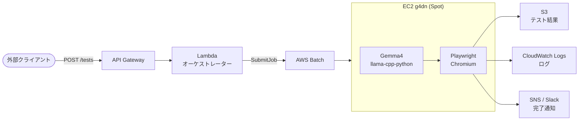

# ドキュメント一覧

Gemma4 × Playwright 自動E2Eテストシステムの概要設計ドキュメント。

## ドキュメント

| ファイル | 概要 |
|----------|------|
| [architecture-overview.md](./architecture-overview.md) | システム全体の構成案（A〜D）の比較と推奨アーキテクチャ |
| [ec2-vs-fargate.md](./ec2-vs-fargate.md) | ECS Fargate と AWS Batch + EC2 の比較・EC2ベース3パターンの検討 |
| [cost-comparison.md](./cost-comparison.md) | CPU推論・GPU推論それぞれのランニングコスト試算（月100回想定） |
| [cold-start-analysis.md](./cold-start-analysis.md) | コンテナ起動フェーズの分解・モデル配置戦略（ECR/AMI/EFS）のコスト込み比較 |
| [concerns-and-visualization.md](./concerns-and-visualization.md) | 懸念事項（セキュリティ・再現性等）と結果視覚化の選択肢 |
| [dev-stack.md](./dev-stack.md) | 開発基盤の技術選定（IaC/Lambda/コンテナの言語・ツール構成） |
| [tasks.md](./tasks.md) | 実装タスク一覧（ステップ別の作業項目） |
| [poc-results.md](./poc-results.md) | Gemma4 PoC検証結果（モデル比較・コード品質評価） |
| [infrastructure-comparison.md](./infrastructure-comparison.md) | インフラ構成のコスト・安定性比較（Vast.ai / AWS Spot / RunPod / Mac mini） |

## 設計サマリー

### 推奨アーキテクチャ

### 技術スタック

| レイヤー | 採用技術 |
|----------|----------|
| IaC | AWS CDK（TypeScript） |
| CI/CD | GitHub Actions |
| オーケストレーター | Lambda（Python） |
| ジョブ管理 | AWS Batch |
| コンテナ実行 | EC2 g4dn（Spot） |
| Gemma4推論 | llama-cpp-python |
| E2Eテスト | Playwright（Python） |
| 結果保存 | S3 + Playwright HTML Report |
| 通知 | SNS / Slack Webhook |

### モデル配置方針

Gemma4の実際のモデルサイズが9.6GB（イメージ合計~11.6GB）となり、戦略を見直した。

| フェーズ | 戦略 | コールドスタート | 月コスト（100回） |
|----------|------|----------------|-----------------|
| PoC | ECRモデル内包・毎回pull | 4〜6分 | $4.33 |
| 運用開始後 | **EC2 Warm Pool**（推奨） | **約1分** | **$2.83** |

- **PoCフェーズ**: Gemma4モデルをコンテナイメージに内包してECRで管理（シンプル優先）
- **運用開始後**: EC2 Warm Poolに移行（停止状態でプールし起動時間を約1分に短縮）
