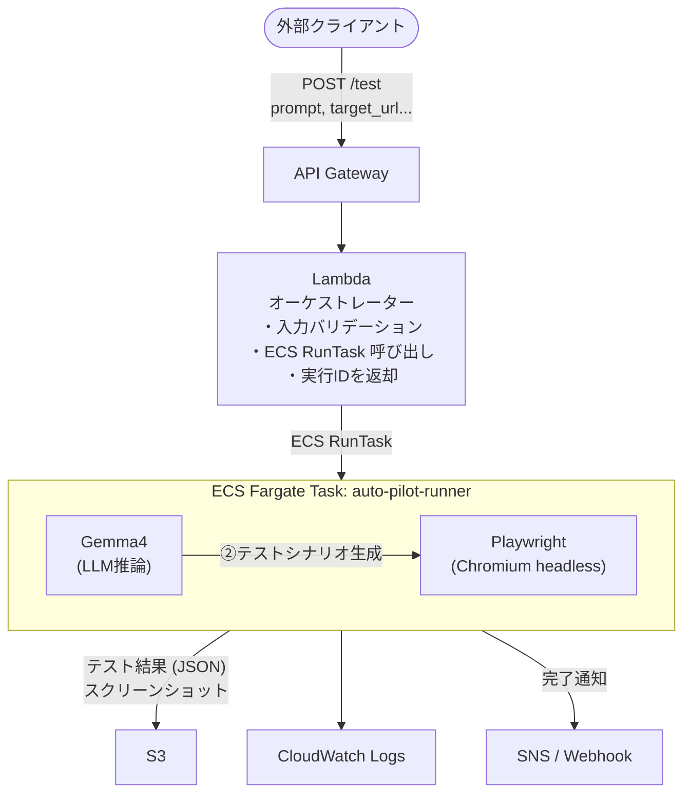
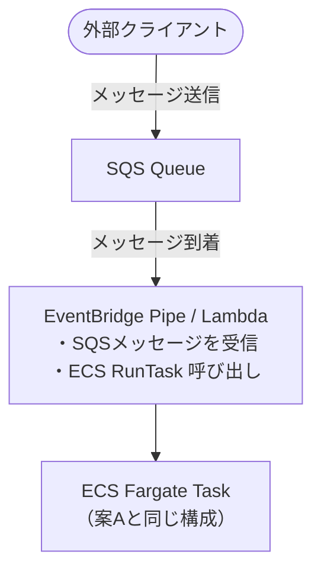
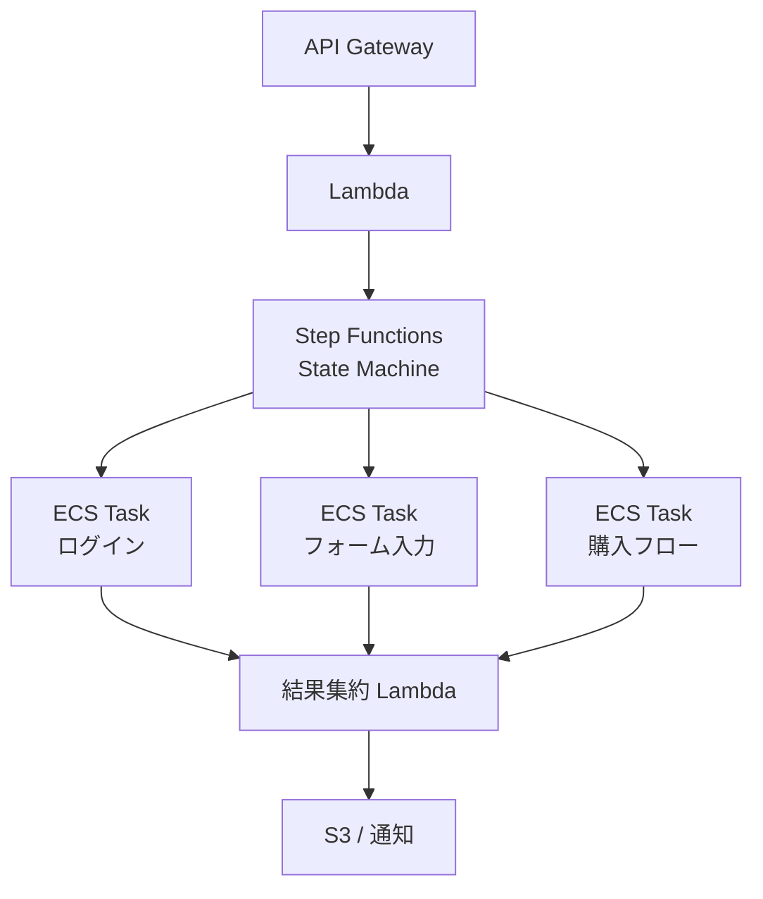
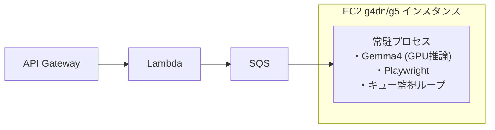
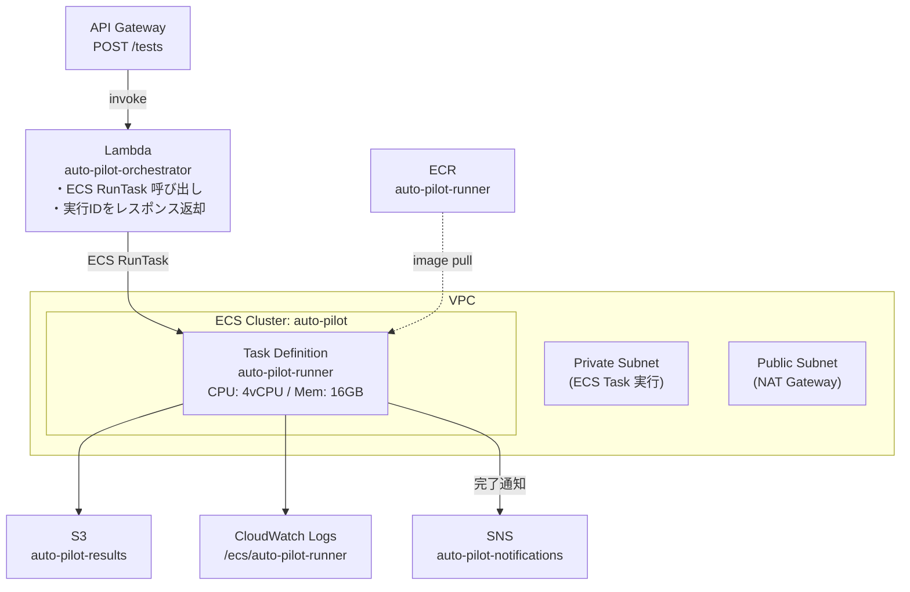

# Gemma4 × Playwright 自動E2Eテストシステム 概要設計

## システム概要

外部からプロンプト（自然言語）で指示を受け取り、Gemma4がテスト内容を解釈してPlaywrightでE2Eテストを実施するサーバレスシステム。

---

## 構成案の比較

### 案A: ECS Fargate オンデマンド起動（推奨）

ユーザー案をベースに、実用性・コストのバランスが最も優れた構成。



**メリット**
- タスクは実行時のみ課金（アイドルコストゼロ）
- スケールアウトが容易（同時並行テスト可）
- コンテナイメージでGemma4 + Playwright の環境を完全制御

**デメリット**
- コールドスタートが遅い（Gemma4モデルロード：30秒〜数分）
- GPUが必要な場合はFargateのGPUサポート制約に注意（現状 Fargate は GPU 非対応）

---

### 案B: SQS キュードリブン ECS（非同期バッチ向け）



**案Aとの違い**
- リクエストが溜まっても順番に処理でき、流量制御が可能
- 最大並行数をSQSのVisibilityTimeout＋ECS上限で制御
- 即時レスポンスが不要な用途（バッチ・CI連携）向け

---

### 案C: Step Functions + ECS（ワークフロー管理向け）



**メリット**
- 複数のテストシナリオを並列・直列で組み合わせ可能
- 各ステップの成否・リトライをステートマシンで管理
- 視覚的なワークフロー確認が可能（Step Functions コンソール）

**デメリット**
- 設計・実装コストが高い
- Step Functions 自体の課金が加算される

---

### 案D: EC2 GPU インスタンス常時起動（Gemma4フル活用）



**メリット**
- GPU推論によりGemma4の応答が大幅に高速（数秒〜10秒程度）
- モデルのウォームアップ済みで即時テスト開始

**デメリット**
- サーバレスではなく常時コストが発生
- Auto Scalingの設計が必要
- 使用頻度が低い場合は非効率

---

## 推奨構成

| 条件 | 推奨案 |
|------|--------|
| 即時レスポンス不要・コスト重視 | **案A（ECS Fargate）** |
| リクエストが大量・流量制御必要 | **案B（SQS + ECS）** |
| 複雑な多段テストシナリオ | **案C（Step Functions）** |
| 推論速度最優先 | **案D（EC2 GPU）** |

**初期開発は案Aを推奨。** SQSでの流量制御が必要になったら案Bへ移行するのが現実的。

---

## 案A 詳細設計

### コンテナ構成

```
auto-pilot-runner (Docker Image on ECR)
├── Gemma4 モデルファイル（またはS3からダウンロード）
├── Python / Node.js ランタイム
├── Playwright + Chromium
└── エントリーポイントスクリプト
     ├── 環境変数からpromptを受け取る
     ├── Gemma4でテストシナリオ（Playwright コード）を生成
     ├── 生成されたコードを実行
     └── 結果をS3に保存して終了
```

### 環境変数（ECS Task Environment）

| 変数名 | 説明 |
|--------|------|
| `TEST_PROMPT` | 自然言語テスト指示 |
| `TARGET_URL` | テスト対象URL |
| `EXECUTION_ID` | 実行識別子（結果保存パスに使用） |
| `RESULT_BUCKET` | S3バケット名 |
| `CALLBACK_URL` | 完了通知先Webhook（任意） |

### テスト実行フロー

```
1. ECS Task 起動
   └─ 環境変数 TEST_PROMPT を取得

2. Gemma4 推論
   └─ prompt → Playwright テストコード（TypeScript/Python）生成

3. Playwright 実行
   ├─ ブラウザ起動（Chromium headless）
   ├─ テストステップ実行
   └─ スクリーンショット・HAR取得

4. 結果保存
   └─ S3: results/{EXECUTION_ID}/
       ├─ result.json    （pass/fail, ステップ詳細, 実行時間）
       ├─ screenshot.png （各ステップ）
       └─ trace.zip      （Playwright Trace）

5. 完了通知
   └─ SNS Topic / Webhook に結果サマリー送信

6. ECS Task 終了
```

### 結果スキーマ（result.json）

```json
{
  "execution_id": "exec-20260411-001",
  "status": "passed | failed | error",
  "prompt": "ログインページでメールとパスワードを入力してログインできることを確認",
  "target_url": "https://example.com",
  "started_at": "2026-04-11T10:00:00Z",
  "finished_at": "2026-04-11T10:03:45Z",
  "steps": [
    {
      "step": 1,
      "description": "ログインページへ遷移",
      "status": "passed",
      "screenshot": "s3://bucket/results/exec-001/step1.png"
    }
  ],
  "error": null
}
```

---

## AWSリソース構成



---

## Gemma4 モデル運用

### モデルサイズと推論環境

| モデル | サイズ | CPU推論（vCPU） | GPU推論 |
|--------|--------|-----------------|---------|
| Gemma4 4B | ~8GB | 16 vCPU / 32GB RAM | g4dn.xlarge |
| Gemma4 12B | ~24GB | 現実的でない | g4dn.2xlarge |
| Gemma4 27B | ~54GB | 現実的でない | g5.2xlarge |

### モデルロード戦略

**Option 1: S3 → ECS Task 起動時にダウンロード**
- コールドスタートに数分かかる
- EBSが不要でシンプル

**Option 2: EFS マウント（モデルをEFSに配置）**
- EFS上のモデルを直接ロード（ダウンロード不要）
- コールドスタートが短縮（EFSのスループット次第）
- EFSの追加コストが発生

**Option 3: モデルをコンテナイメージに内包**
- イメージサイズが大きくなる（ECRコスト増）
- ECRからのプルで初回は遅いが、キャッシュ後は高速

---

## 未決事項・今後の検討

- [ ] Gemma4 の具体的なモデルサイズ選定（精度 vs コスト）
- [ ] GPU対応が必要か（Fargate非対応のため EC2 を使うか）
- [ ] テスト対象サービスが社内VPC内の場合のネットワーク設計
- [ ] 結果の参照UI（S3署名URLをSlack通知？専用ダッシュボード？）
- [ ] テストコードのサンドボックス化（Gemma4生成コードの安全な実行）
- [ ] コスト試算（モデルサイズ・実行頻度による）
