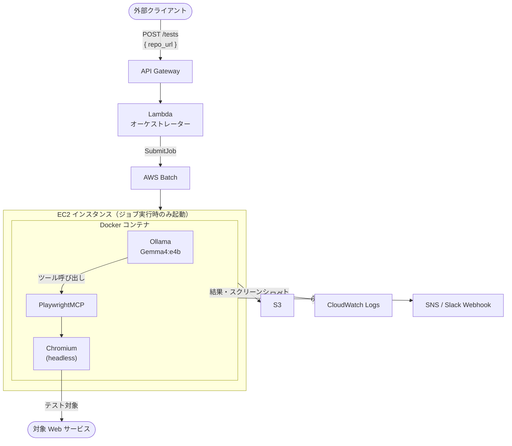

# システムアーキテクチャ

## 構成概要

API Gateway → Lambda → AWS Batch → EC2（Docker）→ S3 のシンプルな構成。  
テスト実行時のみ EC2 が起動し、完了後に自動終了するスケールゼロ構成。

## アーキテクチャ図



## コンポーネント

| コンポーネント | 役割 |
|---|---|
| API Gateway | テスト実行リクエストの受付（POST /tests） |
| Lambda | リクエスト検証・AWS Batch へのジョブ投入 |
| AWS Batch | EC2 インスタンスの起動・ジョブ管理・自動終了 |
| EC2 + Docker | Gemma4 推論 + Playwright 実行環境 |
| Ollama | Gemma4:e4b モデルの推論サーバー |
| PlaywrightMCP | MCP プロトコルで Playwright を操作するサーバー |
| S3 | テスト結果・スクリーンショットの保存 |
| CloudWatch Logs | 実行ログの収集 |
| SNS / Slack | テスト完了通知 |
| ECR | Docker イメージの管理 |

## 実行フロー

```
1. POST /tests { repo_url } 受信
2. Lambda が GitHub から testing.md / e2e-scenarios.md を取得
3. AWS Batch にジョブを投入（シナリオをパラメータとして渡す）
4. EC2 が起動し Docker コンテナを実行
5. Ollama で Gemma4:e4b を起動
6. エージェントループ
   ├── Gemma4 がシナリオを解釈してツール呼び出しを生成
   ├── PlaywrightMCP がブラウザ操作を実行
   └── 結果を Gemma4 にフィードバック（自己修復）
7. テスト結果を S3 に保存
8. SNS / Slack に完了通知
9. EC2 自動終了
```

## Docker イメージ構成

```
ECR: auto-pilot-g4-runner
├── Ubuntu 24.04 (ARM64 or x86_64)
├── Ollama
├── Gemma4:e4b モデル（9.6GB）
├── Node.js + @playwright/mcp
├── Python 3.12
│   ├── ollama（クライアントライブラリ）
│   └── mcp（クライアントライブラリ）
└── Playwright + Chromium
```

## AWS リソース構成

| リソース | 名前 | 備考 |
|---|---|---|
| API Gateway | `auto-pilot-g4-api` | POST /tests |
| Lambda | `auto-pilot-g4-orchestrator` | Python |
| AWS Batch Job Queue | `auto-pilot-g4-queue` | |
| AWS Batch Job Definition | `auto-pilot-g4-job` | EC2 ベース |
| EC2 インスタンスタイプ | `g4dn.xlarge`（GPU）or `c5.4xlarge`（CPU） | PoC は CPU でも可 |
| ECR リポジトリ | `auto-pilot-g4-runner` | |
| S3 バケット | `auto-pilot-g4-results` | |
| CloudWatch Logs | `/aws/batch/auto-pilot-g4` | |
| SNS トピック | `auto-pilot-g4-notifications` | |

## コールドスタート時間の目安

| フェーズ | 所要時間 |
|---|---|
| EC2 起動 | 1〜2 分 |
| Docker コンテナ起動 + ECR pull | 2〜4 分 |
| Ollama 起動 + Gemma4 モデルロード | 1〜2 分 |
| **合計** | **4〜8 分** |

初期フェーズは時間がかかることを許容する設計。
