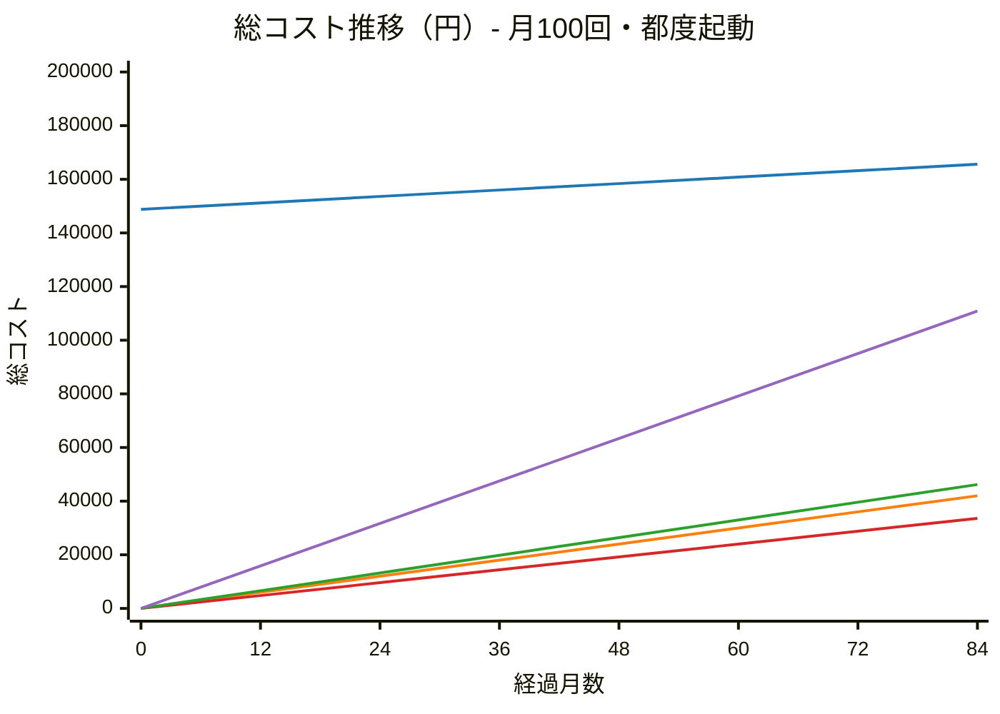

# インフラ構成 コスト・安定性比較

## 前提

- Gemma4:e4b（9.6GB）をGPU推論で使用する想定
- クラウドサービス（Vast.ai / AWS / RunPod）はすべて **時間課金（使った分だけ）** のため、常時起動するかどうかで大きくコストが変わる
- Mac mini は購入後の電気代のみ（使用頻度に関係なく固定）
- 比較は以下 2 シナリオで行う

---

## コスト比較

### シナリオ A：都度起動（月100回・1テスト平均10分）

クラウドの現実的な使い方。テスト実行時のみ起動し、終わったら停止。

| プラン | GPU | 月額 | 初期費用 | 安定性 |
|-------|-----|------|---------|-------|
| **AWS Spot** (g4dn.xlarge) | T4 | ¥400 ※ | なし | △ 中断リスク |
| **Vast.ai** | RTX 4090 | ¥500 ※ | なし | △ ホスト次第 |
| **RunPod Community** | RTX 3090 | ¥550 ※ | なし | ○ |
| **AWS On-demand** (g4dn.xlarge) | T4 | ¥1,320 ※ | なし | ✅ 安定 |
| **Mac mini M4 24GB** | Metal | ¥4,533 ※※ | ¥148,800 | ✅ 安定 |

※ 1テスト10分 × 月100回 = 16.7h/月で算出（$0.16〜0.53/hr × 16.7h × ¥150）  
※※ 36ヶ月償却（¥148,800 ÷ 36 + 電気代¥200）。使用頻度に関わらず固定

### シナリオ B：常時起動（24時間稼働）

| プラン | GPU | 月額 | 安定性 |
|-------|-----|------|-------|
| **Mac mini M4 24GB** | Metal | ¥4,533 | ✅ 安定 |
| **AWS Spot** (g4dn.xlarge) | T4 | ¥17,280 | △ 中断リスク |
| **Vast.ai** | RTX 4090 | ¥21,600 | △ ホスト次第 |
| **RunPod Community** | RTX 3090 | ¥23,760 | ○ |
| **AWS On-demand** (g4dn.xlarge) | T4 | ¥56,800 | ✅ 安定 |

常時起動ではMac miniが圧倒的に安い。クラウドを常時起動することは基本的に想定しない。

---

## 総コスト推移（累計）

シナリオ A（月100回・都度起動）ベースの累計コスト比較。  
Mac miniは初期費用¥148,800 が重く、クラウドは低コストで積み上がる。



> **凡例:** 🔵 Mac mini ／ 🟠 Vast.ai ／ 🔴 AWS Spot ／ 🟢 RunPod ／ 🟣 AWS On-demand

---

## Mac miniとの損益分岐点

### シナリオ A（月100回・都度起動）の場合

| プラン | Mac miniと同コストになる月数 | 備考 |
|-------|:--------------------------:|------|
| AWS Spot | **約744ヶ月**（62年） | 実質 Mac mini が割高のまま |
| Vast.ai | **約496ヶ月**（41年） | 同上 |
| RunPod | **約425ヶ月**（35年） | 同上 |
| AWS On-demand | **約133ヶ月**（11年） | 同上 |

→ **都度起動ならクラウドが圧倒的に安い**（Mac miniの初期費用が回収できない）

### シナリオ B（常時起動）の場合

| プラン | Mac miniが逆転する月数 | 備考 |
|-------|:--------------------:|------|
| AWS On-demand | **約3ヶ月** | Mac miniがすぐ勝利 |
| Vast.ai | **約7ヶ月** | Mac miniが半年で逆転 |
| RunPod | **約7ヶ月** | 同上 |
| AWS Spot | **約9ヶ月** | 同上 |

→ **常時起動ならMac miniが9ヶ月以内に逆転**

---

## 総合評価

| | Vast.ai | AWS Spot | RunPod | Mac mini | AWS On-demand |
|--|:-------:|:--------:|:------:|:--------:|:-------------:|
| 月額コスト（都度起動） | ◎ | ◎ | ◎ | ✗ | ○ |
| 月額コスト（常時起動） | ✗ | ✗ | ✗ | ◎ | ✗ |
| 安定性 | △ | △ | ○ | ◎ | ◎ |
| 推論速度 | ◎ RTX4090 | ○ T4 | ◎ RTX3090 | ◎ Metal | ○ T4 |
| 初期費用 | ◎ | ◎ | ◎ | △ | ◎ |
| 管理コスト | ○ | ○ | ○ | △ 自己管理 | ◎ |

---

## 用途別推奨

```
都度起動・低〜中頻度（月数回〜100回程度）
  → Vast.ai / AWS Spot / RunPod  （¥400〜550/月）

常時起動・長期（9ヶ月以上の運用）
  → Mac mini                      （初期¥148,800、以降¥200/月）

常時起動・短期試用（〜9ヶ月）
  → Vast.ai or AWS Spot           （¥17,000〜22,000/月）

AWS On-demand 常時起動
  → 論外（月¥56,800）
```

---

## 各プランの特徴詳細

### Vast.ai
- マーケットプレイス型。個人・企業がGPUを貸し出す
- 高稼働率ホストを選べばある程度安定
- 突然インスタンスが落ちるリスクあり → 結果をS3等に逐次保存する設計が必要
- RTX 4090 が最安クラスで使える

### AWS Spot
- AWS都合で2分前通知で強制終了される
- Spotが枯渇すると起動できない場合がある
- Warm Pool と組み合わせれば停止リスクを軽減可能
- 東京リージョンで使える安心感

### RunPod Community
- Vast.aiより高いが安定性が上
- 独自のコンテナ実行環境（Dockerベース）
- GPUの種類・在庫が豊富

### Mac mini M4
- 初期費用は高いが長期では最安
- Apple Metal によるGPU推論（高速・省電力）
- 停電・故障リスクは自己管理
- Cloudflare Tunnel で固定IP不要で外部公開可能
- 別用途でも使えるなら実質コストはさらに低くなる

### AWS On-demand（参考）
- 安定性は最高だがコストが論外（月¥56,800）
- 常時起動用途には不適
- オンデマンドの価値は「使った分だけ払う」ことにある

---

## RunPod 利用ケース別比較

### 前提条件

- GPU: RTX 4090（$0.39/hr）
- Gemma4:e4b モデルサイズ: 9.6GB
- コールドスタート時間: 3〜6分（モデルロード込み）
- 1テスト実行時間: 2〜5分
- コールドスタートも課金対象（秒単位）

### ケース別比較表

| ケース | 方式 | 起動時間 | 並列実行 | アイドルコスト | 月コスト目安（100回） | 向いている用途 |
|--------|------|:--------:|:--------:|:--------------:|:--------------------:|----------------|
| **常時起動** | Pod（停止なし） | なし | ✅（VRAM次第） | $0.39/hr | ~$280（¥42,000） | 頻繁に実行（1日10回以上） |
| **都度起動/停止** | Pod（手動 or API） | 1〜3分 | ✅（Pod複数起動） | ストレージのみ | ~$3〜7（¥450〜1,050） | 週数回程度 |
| **サーバレス** | Serverless Worker | 3〜6分 | ✅（自動スケール） | $0 | ~$5〜12（¥750〜1,800） | 低頻度・バースト |

※ 為替レート: 1USD = ¥150 換算

### コールドスタートのコスト影響

```
1テストあたりの課金内訳（サーバレス）

コールドスタート: 3〜6分 × $0.0065/min = $0.02〜0.04
推論・テスト実行: 2〜5分 × $0.0065/min = $0.01〜0.03
─────────────────────────────────────────────────
合計: $0.03〜0.07 / 1テスト
月100回: $3〜7
```

### 方式の選び方

```
実行頻度が高い（1日10回以上）   → 常時起動        （起動待ち不要、月$280）
実行頻度が中程度（週数回）      → Pod 起動/停止   （バランス良い、月$3〜7）
実行頻度が低い・突発的          → サーバレス      （コールドスタート許容できれば最安）
並列実行が必須                  → Pod 複数起動 or サーバレス
```

### 補足: Pod 起動/停止の自動化

RunPod は API を提供しているため、テスト実行リクエストをトリガーに Pod を自動起動・停止できます。

```
1. テストリクエスト受信（Lambda等）
2. RunPod API → Pod 起動
3. テスト実行（2〜5分）
4. 結果をS3に保存
5. RunPod API → Pod 停止
```

この構成により、**サーバレスの料金感覚で Pod の安定性**を得られます。
