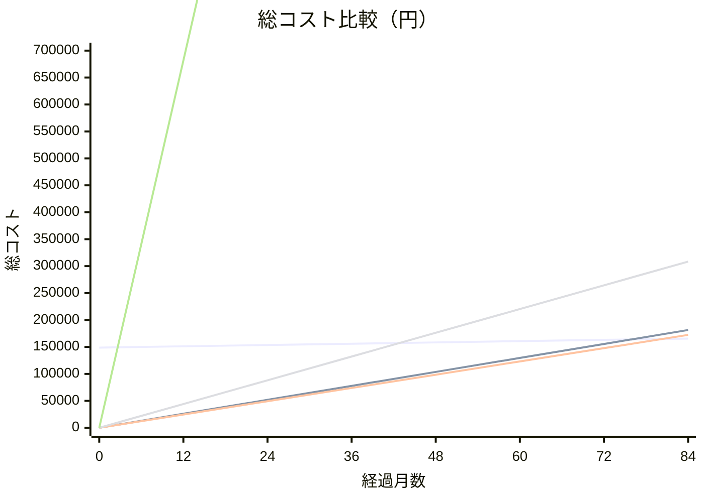

# インフラ構成 コスト・安定性比較

## 前提

- Gemma4:e4b（9.6GB）をGPU推論で常時起動する想定
- 安定性の優先度によって最適解が変わる

---

## 月額コスト比較（常時起動）

| プラン | GPU | 月額 | 初期費用 | 安定性 |
|-------|-----|------|---------|-------|
| **Vast.ai** | RTX 4090 | ¥2,160 | なし | △ ホスト次第 |
| **AWS Spot** (g4dn.xlarge) | T4 | ¥2,052 | なし | △ 中断リスク |
| **RunPod Community** | RTX 3090 | ¥3,672 | なし | ○ |
| **Mac mini M4 24GB** | Metal | ¥4,533 ※ | ¥148,800 | ✅ 安定 |
| **AWS On-demand** (g4dn.xlarge) | T4 | ¥56,800 | なし | ✅ 安定 |

※ 36ヶ月償却（¥148,800 ÷ 36 + 電気代¥200）

---

## 総コスト推移（累計）



> **凡例（上から順）:** 1本目: Mac mini ／ 2本目: Vast.ai ／ 3本目: AWS Spot ／ 4本目: RunPod ／ 5本目: AWS On-demand（グラフ外に突出）

---

## Mac miniとの損益分岐点

| プラン | 損益分岐 | 備考 |
|-------|---------|------|
| AWS On-demand | **約3ヶ月** | Mac miniが即勝利 |
| RunPod | **約35ヶ月**（2.9年） | 3年以内ならRunPodが安い |
| Vast.ai | **約76ヶ月**（6.3年） | 6年以上使うならMac miniが安い |
| AWS Spot | **約80ヶ月**（6.7年） | Vast.aiとほぼ同じ |

---

## 総合評価

| | Vast.ai | AWS Spot | RunPod | Mac mini | AWS On-demand |
|--|:-------:|:--------:|:------:|:--------:|:-------------:|
| 月額コスト | ◎ | ◎ | ○ | ○ | ✗ |
| 安定性 | △ | △ | ○ | ◎ | ◎ |
| 推論速度 | ◎ RTX4090 | ○ T4 | ◎ RTX3090 | ◎ Metal | ○ T4 |
| 初期費用 | ◎ | ◎ | ◎ | △ | ◎ |
| 管理コスト | ○ | ○ | ○ | △ 自己管理 | ◎ |
| 長期コスト | ◎ | ◎ | ○ | ◎ | ✗ |

---

## 用途別推奨

```
短期（〜3年）かつ安定性不問  → Vast.ai or AWS Spot  （¥2,000〜/月）
短期（〜3年）かつ安定性重視  → RunPod               （¥3,672/月）
長期（3年以上）              → Mac mini             （初期¥148,800、以降¥200/月）
AWS On-demand 常時起動       → 論外（他の10倍以上）
```

---

## 各プランの特徴詳細

### Vast.ai
- マーケットプレイス型。個人・企業がGPUを貸し出す
- 高稼働率ホストを選べばある程度安定
- 突然インスタンスが落ちるリスクあり → 結果をS3等に逐次保存する設計が必要
- RTX 4090 が最安クラスで使える

### AWS Spot
- AWS都合で2分前通知で強制終了される
- Spotが枯渇すると起動できない場合がある
- Warm Pool と組み合わせれば停止リスクを軽減可能
- 東京リージョンで使える安心感

### RunPod Community
- Vast.aiより高いが安定性が上
- 独自のコンテナ実行環境（Dockerベース）
- GPUの種類・在庫が豊富

### Mac mini M4
- 初期費用は高いが長期では最安
- Apple Metal によるGPU推論（高速・省電力）
- 停電・故障リスクは自己管理
- Cloudflare Tunnel で固定IP不要で外部公開可能
- 別用途でも使えるなら実質コストはさらに低くなる

### AWS On-demand（参考）
- 安定性は最高だがコストが論外（月¥56,800）
- 常時起動用途には不適
- オンデマンドの価値は「使った分だけ払う」ことにある
