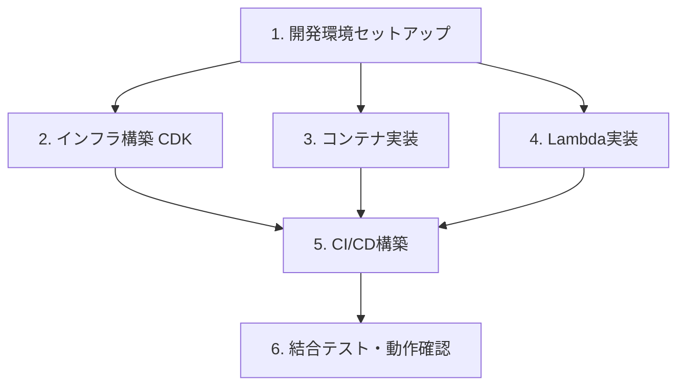

# 実装タスク一覧

## タスク概要



---

## 1. 開発環境セットアップ

| # | タスク | 詳細 |
|---|--------|------|
| 1-1 | ローカルツールインストール | Node.js 22+, AWS CDK CLI, Python 3.12+, Docker Desktop, AWS CLI v2, uv |
| 1-2 | AWSクレデンシャル設定 | IAMユーザー or IAM Identity Center でCLI認証設定 |
| 1-3 | CDKブートストラップ | `cdk bootstrap` をデプロイ先AWSアカウント・リージョンで実行 |
| 1-4 | Gemma4ローカル動作確認 | Ollama で `gemma4` を起動しプロンプト→コード生成が機能することを確認 |

---

## 2. インフラ構築（CDK TypeScript）

### 2-1. CDKプロジェクト初期化

| # | タスク | 詳細 |
|---|--------|------|
| 2-1-1 | `infra/` 初期化 | `cdk init app --language typescript` |
| 2-1-2 | Stackファイル構成 | `network-stack`, `storage-stack`, `batch-stack`, `api-stack` に分割 |

### 2-2. ネットワーク（network-stack）

| # | タスク | 詳細 |
|---|--------|------|
| 2-2-1 | VPC作成 | パブリック/プライベートサブネット、NATゲートウェイ |
| 2-2-2 | セキュリティグループ | Batchタスク用（アウトバウンドのみ許可） |

### 2-3. ストレージ・レジストリ（storage-stack）

| # | タスク | 詳細 |
|---|--------|------|
| 2-3-1 | S3バケット作成 | テスト結果・HTMLレポート格納用、バージョニング有効 |
| 2-3-2 | ECRリポジトリ作成 | `auto-pilot-runner` イメージ用 |
| 2-3-3 | S3静的ウェブサイト設定 | Playwright HTMLレポートを公開する場合（CloudFront + OAC） |

### 2-4. AWS Batch（batch-stack）

| # | タスク | 詳細 |
|---|--------|------|
| 2-4-1 | Compute Environment作成 | EC2 g4dn.xlarge, Spot優先, maxvCpus制限（コスト暴走防止） |
| 2-4-2 | Job Queue作成 | Compute Environmentに紐付け |
| 2-4-3 | Job Definition作成 | コンテナイメージ, vCPU/メモリ, 環境変数, IAMロール設定 |
| 2-4-4 | IAMロール作成（Task Role） | S3書き込み, CloudWatch Logs書き込み, SNS発行 |

### 2-5. API + Lambda（api-stack）

| # | タスク | 詳細 |
|---|--------|------|
| 2-5-1 | Lambda関数定義 | `lambda/handler.py` を参照、Python 3.12 |
| 2-5-2 | IAMロール作成（Lambda Role） | Batch SubmitJob, CloudWatch Logs書き込み |
| 2-5-3 | API Gateway作成 | `POST /tests` エンドポイント、Lambdaプロキシ統合 |
| 2-5-4 | SNS Topicの作成 | 完了通知用（メール or Slackサブスクリプション） |

---

## 3. コンテナ実装（runner/）

| # | タスク | 詳細 |
|---|--------|------|
| 3-1 | Dockerfile作成 | Python 3.12 + llama-cpp-python（CUDA対応） + Playwright + Chromium |
| 3-2 | Gemma4モデル組み込み | HuggingFaceからGGUFをダウンロードしてイメージに内包 |
| 3-3 | プロンプト設計（prompt_builder.py） | システムプロンプト（Playwrightベストプラクティス + Few-shot）の作成 |
| 3-4 | テスト実行ロジック（test_executor.py） | 生成コードの実行、ステップごとのスクリーンショット取得 |
| 3-5 | 結果アップロード（result_uploader.py） | result.json + スクリーンショット + HTMLレポートのS3アップロード |
| 3-6 | 完了通知（notifier.py） | SNS または Slack Webhook への結果サマリー送信 |
| 3-7 | ローカル動作確認 | `docker run` でプロンプト→テスト→結果出力までE2Eで確認 |

---

## 4. Lambda実装（lambda/）

| # | タスク | 詳細 |
|---|--------|------|
| 4-1 | handler.py実装 | リクエストバリデーション + Batch SubmitJob呼び出し + jobId返却 |
| 4-2 | ローカル動作確認 | `python handler.py` でBatch SubmitJobが呼び出されることを確認 |

---

## 5. CI/CD構築（GitHub Actions）

| # | タスク | 詳細 |
|---|--------|------|
| 5-1 | AWSクレデンシャルのシークレット設定 | `AWS_ACCESS_KEY_ID`, `AWS_SECRET_ACCESS_KEY` をGitHub Secretsに登録 |
| 5-2 | コンテナビルド・ECR pushワークフロー | `runner/` 配下の変更時にdocker build → ECR push |
| 5-3 | CDK deployワークフロー | `infra/` 配下の変更時に `cdk deploy --all` |
| 5-4 | ワークフローのトリガー設計 | mainブランチpush時に自動実行 or 手動実行（workflow_dispatch）|

---

## 6. 結合テスト・動作確認

| # | タスク | 詳細 |
|---|--------|------|
| 6-1 | API疎通確認 | `curl -X POST /tests` でBatch jobが起動することを確認 |
| 6-2 | E2E動作確認 | シンプルなプロンプト（例: 「Google.comにアクセスしてタイトルを確認」）で一連のフローを確認 |
| 6-3 | 結果確認 | S3にresult.json・HTMLレポートが保存されることを確認 |
| 6-4 | 通知確認 | SNS/Slackに完了通知が届くことを確認 |
| 6-5 | 異常系確認 | 不正なプロンプト・到達不能URLでのエラーハンドリング確認 |

---

## 優先順位と進め方

```
Step 1（環境確立）:  1-1 〜 1-4, 2-1
Step 2（インフラ）:  2-2 〜 2-5（cdk deploy まで）
Step 3（コンテナ）:  3-1 〜 3-7（ローカルで動くまで）
Step 4（Lambda）:   4-1 〜 4-2
Step 5（CI/CD）:    5-1 〜 5-4
Step 6（確認）:     6-1 〜 6-5
```

コンテナ（Step 3）とインフラ（Step 2）は並行して進められる。

---

## 最初に取り組むべきこと

**Step 3（コンテナのローカル確認）を最優先にする。**

理由: Gemma4がプロンプトからPlaywrightコードを生成し、正しく実行できるかどうかがシステム全体の成否を握るコア部分。ここが機能しなければインフラを構築しても無意味になるため、最初にローカルで検証することで手戻りを防ぐ。

### 最初に確認すべきこと

| 確認項目 | 方法 |
|----------|------|
| Gemma4がPlaywrightコードを生成できるか | OllamaでGemma4を起動し、プロンプトを与えてコード生成を試す |
| 生成されたコードがPlaywrightとして動作するか | ローカルのPlaywright環境で実行して確認 |
| 複数パターンのプロンプトで品質が安定するか | 数種類のテスト指示を与えてコード品質を評価 |

### 推奨する最初の3タスク

```
1. ローカルにOllamaをインストールしてGemma4を起動（タスク1-4）
2. Pythonスクリプトでプロンプト→コード生成→Playwright実行を試作（タスク3-3, 3-4の先行PoC）
3. 品質が許容範囲であればインフラ構築（Step 2）に並行着手
```

> もしGemma4の生成品質が不十分な場合は、システムプロンプトの改善やモデルサイズの変更（4B→12B等）を先に検討する。
